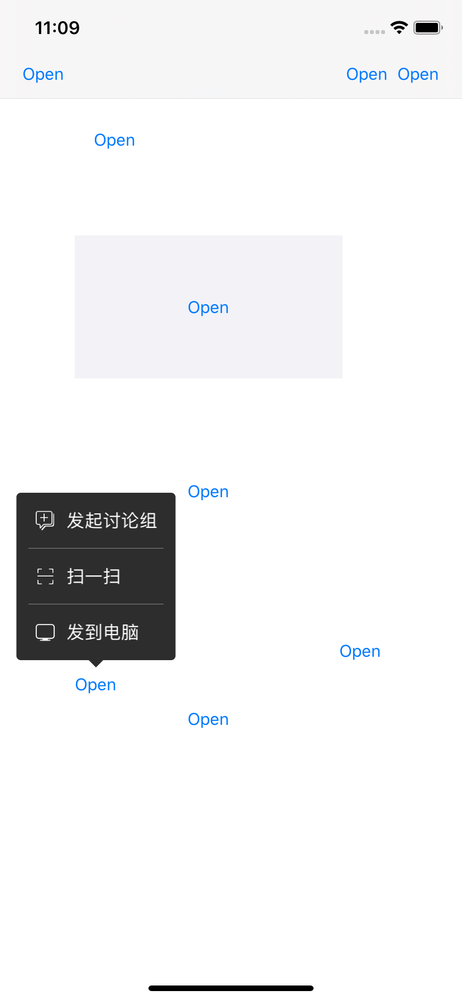

# PopMenu
A menu to show selections

简单介绍 后续有时间再具体markdown

通过 1.view（含button之类） 2.BarButtonItem(use customView) 的位置呼出菜单 

自动计算显示的位置、显示的宽高、箭头方法

目前支持了全屏幕的任意位置显示 

由于时间成本问题（懒） 没有添加弹出和隐藏动画  

ps.模拟器因为像素原因 会出现奇怪线条问题 真机不存在 

