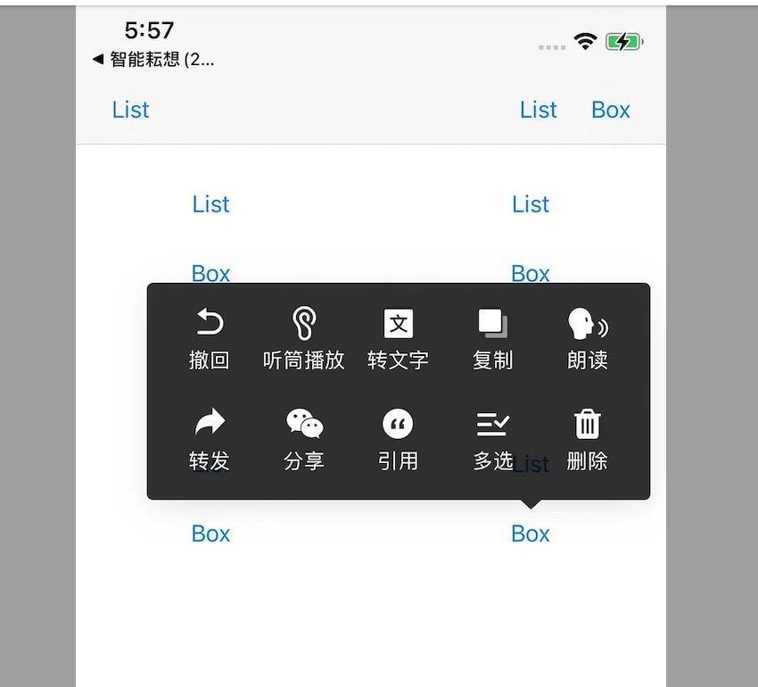
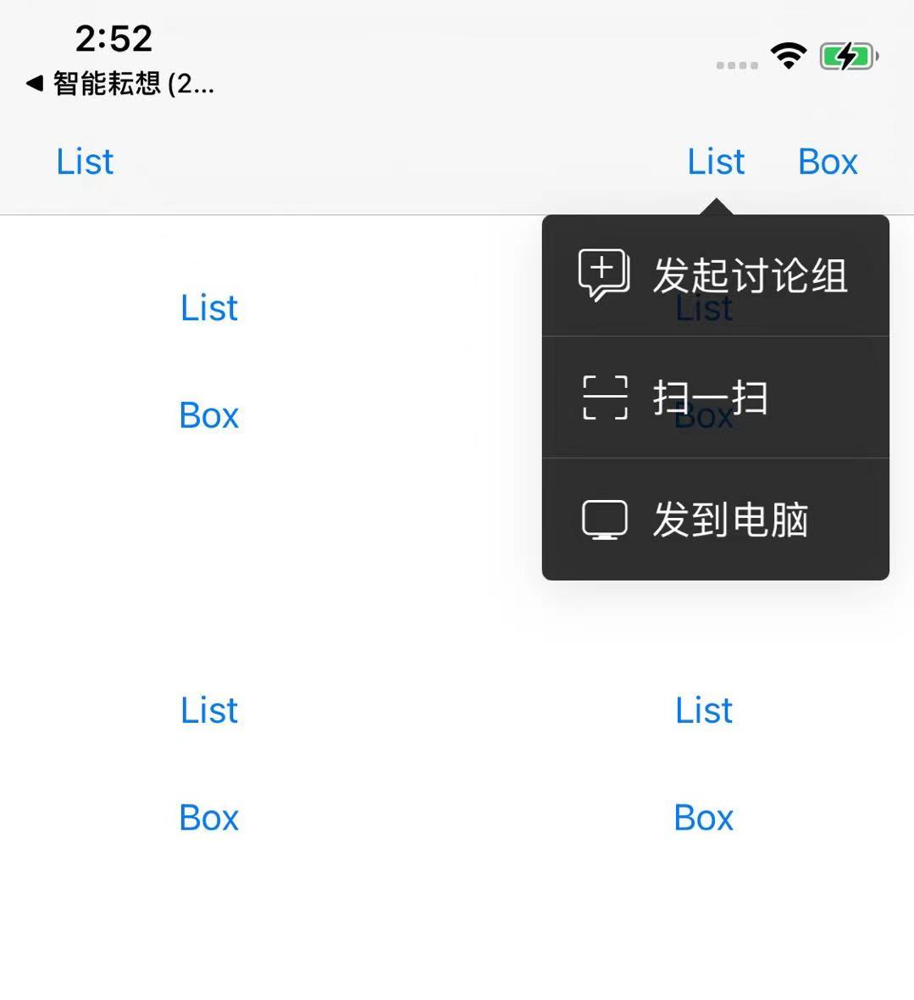

# PopMenu

本控件集成了 仿微信IM“聊天长按菜单” 以及 “更多功能下拉菜单” 两种样式。

之所以放在同一个控件中，是因为计算位置的代码一致，只有计算frame的代码不同。

希望它能够帮助到你实现功能。

简书 https://www.jianshu.com/p/e2ec10ee3e9d

# Fix Bugs

[2021.06.07] 

发现有时箭头和框体之间有一条白线，从Debug View Hierarchy(切面层级图)中看到计算位置没有问题。

经过仔细排查发现是因为视图的origin.y值非浮点整数，但是屏幕像素点都是整数的，此时出现了意想不到的问题。

所以计算出targetView的frame时，对y值进行了ceil()操作。当然，进行floor()或者round()都是可以的。

问题得到了解决。

# 功能

1. 控件自动根据target 的位置呼出菜单。 target可以是 1.view（含button之类） 2.BarButtonItem(use customView)

2. 自动计算显示的位置、显示的宽高、箭头方向。显示的菜单是向上或者向下的。

3. 支持全屏幕的任意位置显示，包括naviBar上，视图上和子视图。

