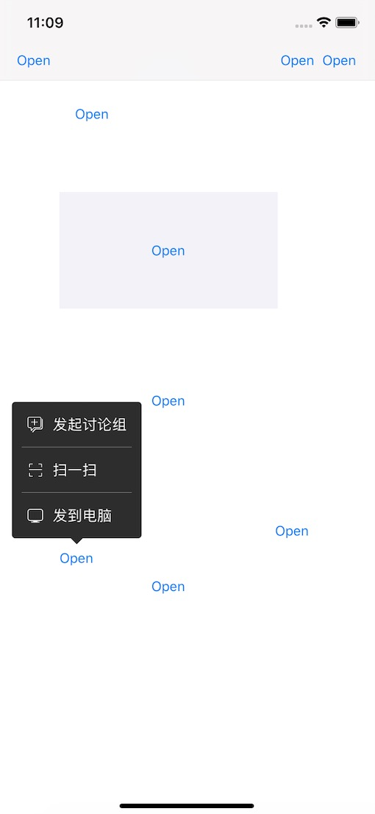

# PopMenu
A menu to show selections

1. 控件自动根据target 的位置呼出菜单 ### target可以是 1.view（含button之类） 2.BarButtonItem(use customView)

2. 自动计算显示的位置、显示的宽高、箭头方向。显示的菜单是向上或者向下的。

3. 支持全屏幕的任意位置显示，包括naviBar上，视图上和子视图。

4. 增加了仿照微信聊天界面长按菜单的样式。

